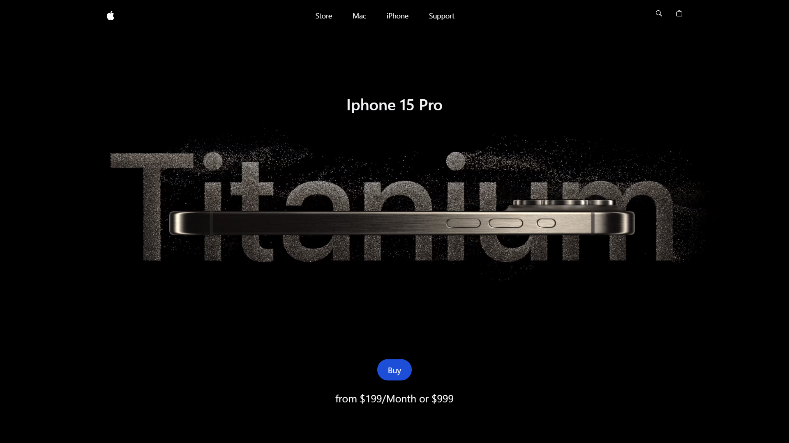
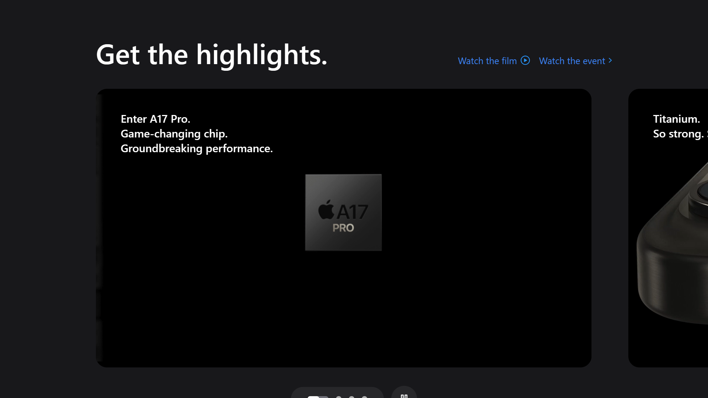
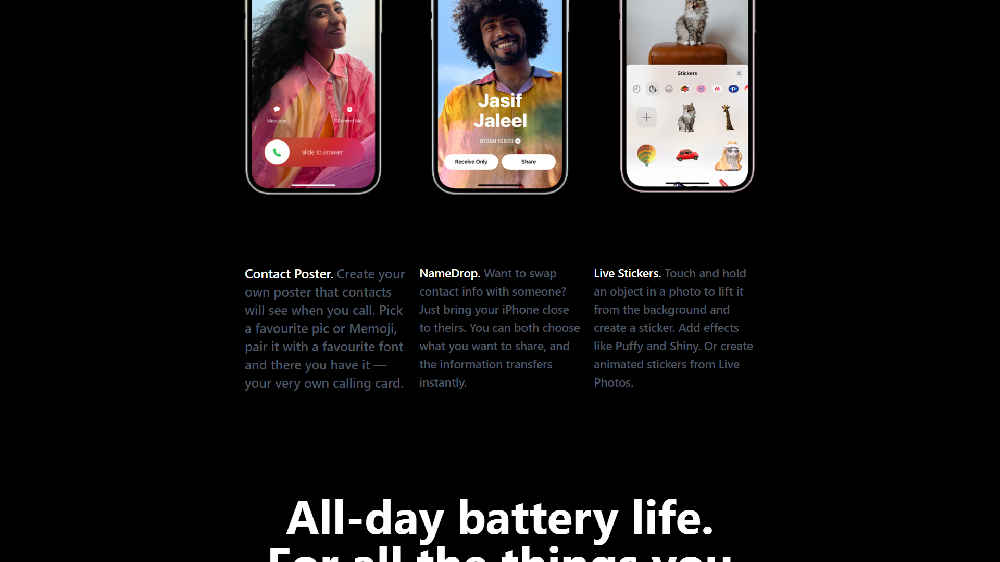
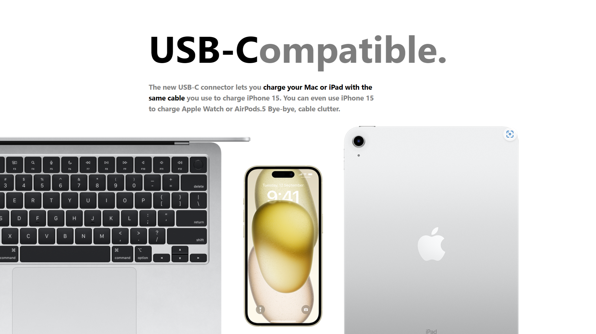

<h3 align="center">Iphone 15 Website</h3>

## [AppleWebsite](https://iphone15website.netlify.app/)

# Introduction

This is a clone of Apple's iPhone 15 Pro website using React.js and TailwindCSS. It highlights the effective use of GSAP (Greensock Animations) for displaying iPhone 15 Pro models in various colors and shapes.

# <a name="tech-stack">⚙️ Tech Stack</a>

- React.js
- React Three Fiber
- GSAP (Greensock)
- Vite
- Tailwind CSS

# <a name="features">🔋 Features</a>

**Beautiful Subtle Smooth Animations using GSAP**: Enhanced user experience with seamless and captivating animations powered by GSAP.

**Custom Video Carousel (made with GSAP)**: Engage users with a unique and interactive video carousel developed using GSAP for a personalized browsing experience.

**Completely Responsive**: Consistent access and optimal viewing on any device with a fully responsive design that adapts to different screen sizes.

and many more, including code architecture and reusability

